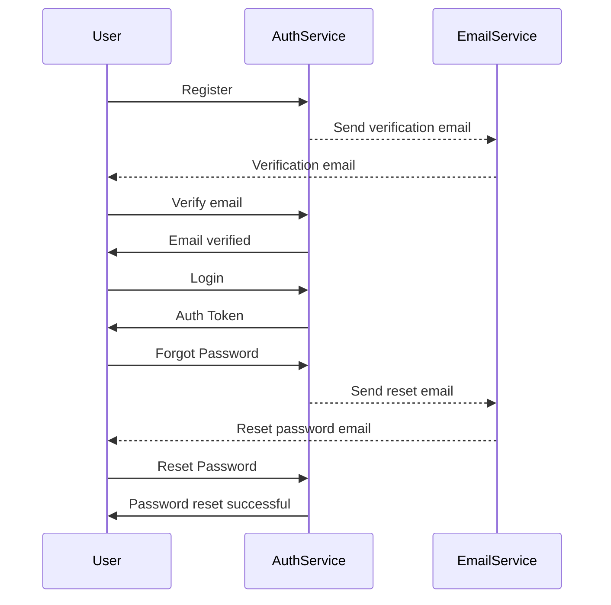

# E-commerce API

## Overview

This is a RESTful API for an e-commerce platform.

## Installation

To get started, clone this repository and install the dependencies:

```bash
git clone https://github.com/madihanazir/ecommerce-api.git
cd ecommerce-api
npm install
```

## Usage

### Endpoints

- `POST /register`
- `POST /login`
- `POST /forgot-password`
- `POST /reset-password`

## Sequence Diagram



## License

This project is licensed under the MIT License.