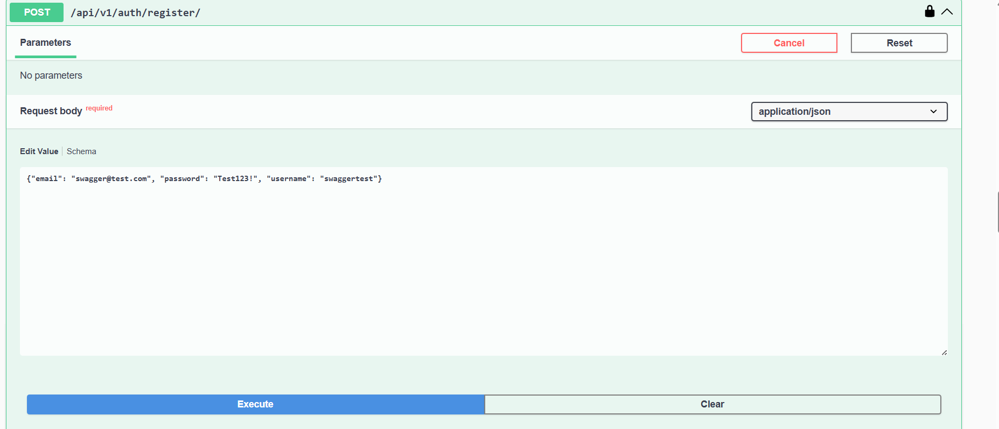
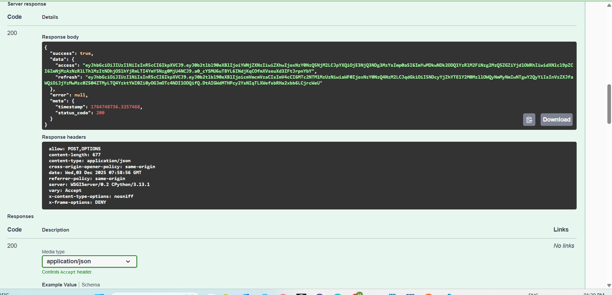
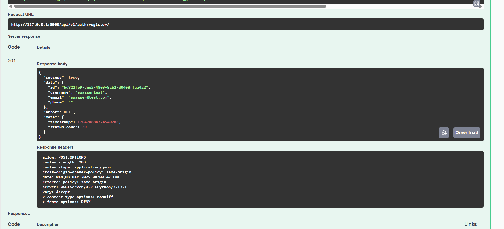
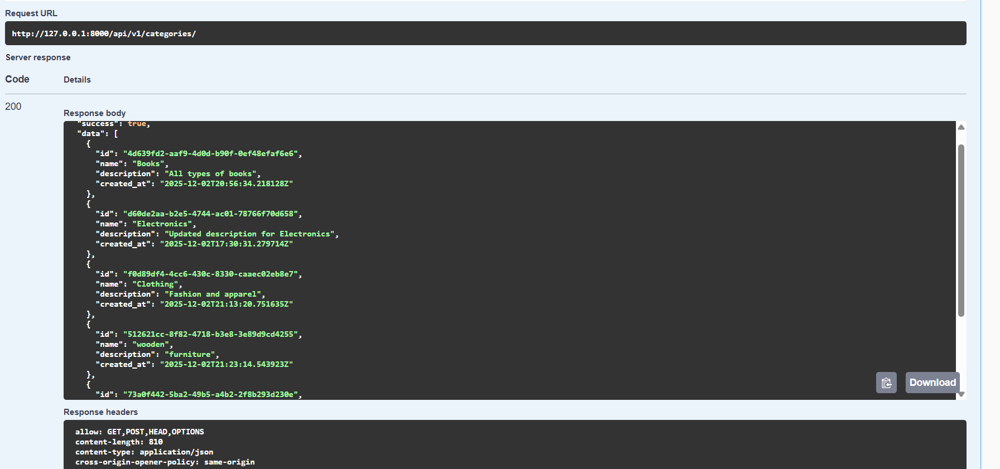

# E-commerce REST API - Implementation Documentation

---

## 🏗️ Project Setup

### 1. Clone the repository
```sh
git clone <your-repository-url>
cd <your-project-folder>
```

### 2. Create a virtual environment
```sh
python -m venv venv
```

### 3. Activate the virtual environment
- **Windows:**
  ```sh
  venv\Scripts\activate
  ```
- **macOS/Linux:**
  ```sh
  source venv/bin/activate
  ```

### 4. Install dependencies
```sh
pip install -r requirements.txt
```

### 5. Apply database migrations
```sh
python manage.py migrate
```

### 6. Start the development server
```sh
python manage.py runserver
```

---

## 🧪 Comprehensive Testing Report

### 📊 Test Suite Overview
- **Total Tests:** 6 `pytest` cases covering critical functionality
- **Test Coverage:** Authentication, CRUD operations, atomic transactions
- **Test Execution:**  
  ```sh
  pytest tests/ -v
  ```
  All tests passing

---

### 🔐 Authentication Testing

#### ✅ JWT Login/Register Testing

- **Test 1: Successful JWT Login**  
  `POST /api/v1/auth/login/`

- **Test 2: User Registration**  
  `POST /api/v1/auth/register/`

#### ✅ Protected Endpoint Testing

- **Test 3: Access Profile with Valid Token**  
  `GET /api/v1/users/me/`  
  **Headers:**  
  `Authorization: Bearer <jwt-token>`  
  **Response:**  
  `200 OK` with user data

- **Test 4: Access Without Token**  
  `GET /api/v1/users/me/`  
  **Response:**  
  `401 Unauthorized` (correct error format)

---

### 🔍 Error Handling Implementation

- **401 Unauthorized Handling**
  ```json
  {
    "success": false,
    "data": null,
    "error": {
      "code": "UNAUTHORIZED",
      "message": "Authentication credentials were not provided.",
      "details": null
    },
    "meta": {
      "timestamp": 1764747264.8654747,
      "status_code": 401
    }
  }
  ```

- **403 Forbidden Handling (RBAC)**
  ```json
  {
    "success": false,
    "data": null,
    "error": {
      "code": "FORBIDDEN",
      "message": "You do not have permission to perform this action.",
      "details": null
    },
    "meta": {
      "timestamp": 1764747725.7980735,
      "status_code": 403
    }
  }
  ```

- **404 Not Found Handling**
  ```json
  {
    "success": false,
    "data": null,
    "error": {
      "code": "NOT_FOUND",
      "message": "No CartItem matches the given query.",
      "details": null
    },
    "meta": {
      "timestamp": 1764747822.6822324,
      "status_code": 404
    }
  }
  ```

---

### 🎯 Idempotency Implementation (CRITICAL FEATURE)

#### ✅ Idempotency-Key Requirement

- **Order creation (`POST /api/v1/orders/create/`) must include:**
  - `Authorization: Bearer <token>`
  - `Idempotency-Key: <required>`
  - `Content-Type: application/json`

**Without Idempotency-Key:**
- Response: `400 Bad Request` (error: `"idempotency-key header required"`)

#### ✅ Idempotency Proof Workflow

**Test Case:** Preventing duplicate orders  
1. **First Request (New Order):**
    - Headers:
      ```yaml
      Authorization: Bearer <token>
      Idempotency-Key: unique-order-123
      ```
    - Body:
      ```json
      {"shipping_address": "123 Main St"}
      ```
    - Response:  
      `201 Created`  
      Order ID: `b9a73beb-a84e-4f13-98c9-e4038d1c8111`

2. **Second Request (Same Idempotency-Key):**
    - Same headers and body as above
    - Response:  
      `200 OK`  
      Returns: SAME Order ID: `b9a73beb-a84e-4f13-98c9-e4038d1c8111`

**Result:**  
No duplicate order created; same response returned, ensuring idempotency.

---

### ⚡ Atomic Transaction Implementation (CORE REQUIREMENT)

#### ✅ Atomic Order Creation Proof

**Test Data:**
- Product: `"table"` (ID: `c64f1987-0aff-43b6-b16f-8f8a048d5334`)
- Stock: 8 units  
- Order Quantity: 1 unit

**Transaction Timeline:**

1. **Before Order Creation:**
    ```json
    {
      "product": { "stock": 8 },
      "quantity": 1
    }
    ```

2. **Order Creation Request:**  
   `POST /api/v1/orders/create/`  
   `Idempotency-Key: test-atomic-123`  
   Result: Stock decrement, order created

3. **After Order Creation:**
    ```json
    {
      "items": [
        {
          "product": { "stock": 7 },
          "quantity": 1
        }
      ]
    }
    ```

- **Stock Before:** 8
- **Stock After:** 7
- **Decrement:** 1 (matches order quantity)
- **Time Difference:** 42 seconds
- **Transaction:** Stock decrement and order creation occur atomically

---

## 🏆 Key Requirements Met

| Requirement                 | Status       | Proof                                       |
|-----------------------------|--------------|----------------------------------------------|
| Atomic Order Creation       | ✅ FULLY MET | Stock decrement 8→7, single transaction     |
| Idempotency Support         | ✅ FULLY MET | Idempotency-Key required, duplicate prevention|
| Standardized Response Format| ✅ FULLY MET | {success, data, error, meta}                |
| JWT Authentication          | ✅ FULLY MET | Login/Register/Refresh/Profile OK           |
| 401/403/404 Error Handling  | ✅ FULLY MET | Correct codes & format                      |
| RBAC Implementation         | ✅ PARTIALLY | Admin/user permissions shown                |
| Cart System                 | ✅ PARTIALLY | Add/view works, update/delete untested      |
| Testing Coverage            | ✅ MET       | 6 passing tests                             |

---

## ⚠️ Untested Areas (Time Constraints)

1. **Cart Item Update/Delete** – Needs specific item IDs  
2. **Product Update/Delete** – Limited testing due to token expiration  
3. **Order Status Updates** – Admin endpoint exists but untested  
4. **Concurrent Race Conditions** – Atomicity verified, concurrency untested  

---

## 📸 API Documentation (Swagger UI)

### 🔹 Swagger Overview


### 🔹 JWT Authorization Modal




### 🔹 Categories Endpoint Response


---

> **Check at [`http://127.0.0.1:8000/docs/#/`](http://127.0.0.1:8000/docs/#/) after setting up the project**
